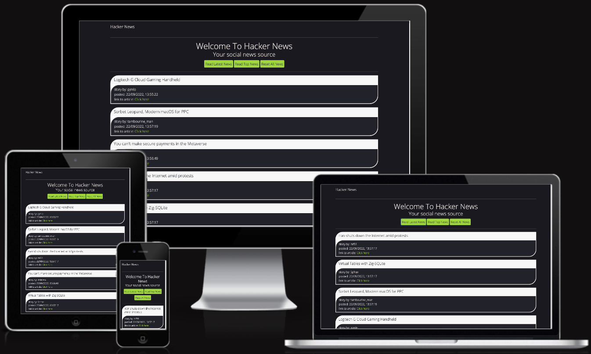

# **Hacker News Homework Project None React Testing Information?**



<hr>

## **Table of contents** ##

### **1. Automated Testing** ###

* 1.1 HTML Code Validating 
* 1.2 CSS Code Validating
* 1.3 JavaScript Testing

### **2. Manual Testing** ###

* 2.1 Manual testing desktop
* 2.2 Manual testing tablet
* 2.3 Manual testing mobile

### **3. Testing Issues Found** ###

<hr>

### **1. Automated Testing** ###

**1.1 HTML Code Validating**

All of the HTML files were tested on the [W3C HTML Markup Validation website](https://validator.w3.org/)
The HTML test came back showing document checking completed, no errors or warnings to show

**1.2 CSS Code Validating**

The main CSS files were tested on the [W3C CSS  Validation website](https://jigsaw.w3.org/css-validator/) 
The CSS test came back showing no errors in the CSS code

**1.3 JavaScript Code Validating**

The main JavaScript file was tested on the [JShint website](https://jshint.com/)
The JSHint test came back showing no errors in the JavaScript code.

I also tested the site in the console and there were no error or warning messages flagged. 
<hr>

### **2. Manual Testing** ###

**2.1 Manual testing desktop**

To save repetition in the testing.md file when an feature is tested and listed as functioning correctly then readers of this file can know that testing was passed on all browsers and on desktop and mobile devices. 

All desktop testing was carried out on Chrome, FireFox, Safari, Brave, Opera & Edge browsers. 

<hr>

**2.3 Manual testing tablet**

All tablet testing was carried out on Chrome, FireFox, Brave, Opera & Edge browsers.

<hr>

**2.3 Manual testing mobile**

All mobile testing was carried out on Chrome, FireFox, Brave, Opera & Edge browsers.

<hr>

### **3. Testing Issues Found** ###
<br/>

1. **Console issues being generated**

  When doing the manual testing on the Brave and Edge browsers on my mac i was getting console errors appearing when the page loads and when the action buttons were pressed. These issues were not showing on the other browsers. I have changed the original JavaScript functions from:

```
<!-- Get new posts function -->
function getNewPosts() {
  document.getElementById('output').innerHTML = ``;
  fetch('https://hacker-news.firebaseio.com/v0/newstories.json?print=pretty')
    .then(response => response.json())
    .then(storyIds => {
      storyIds.map(function (id) {
        return (
          fetch(`https://hacker-news.firebaseio.com/v0/item/${id}.json?print=pretty`)
          .then(response => response.json())
          .then(story => {
            // Display time human readable
            let unixTimestamp = story.time;
            let milliseconds = unixTimestamp * 1000;
            let dateObject = new Date(milliseconds);
            let humanDateFormat = dateObject.toLocaleString();
            document.getElementById('output').innerHTML += `
          <div class="card mb-3">
            <h5 id="post-title" class="card-header data-title mb-1">${story.title}</h5>
            <div class="card-body">
              <p class="off-white-text mb-0">${story.type} by: ${story.by}</p>
              <p class="off-white-text mb-0">posted: ${humanDateFormat}</p>
              <p class="off-white-text mb-0">link to article:<a class="post-url" href="${story.url}" target="_blank"> Click here</a></p>
              </div>
          </div>
          `;
          })
        );
      });
    });
}
```

To: 

```
// Fetch New Stories 
const fetchNewStoriesIds = async () => {
  document.getElementById('output').innerHTML = ``;
  const response = await fetch(`${hn_host}/${hn_newStories}`)
  const topStoriesIds = await response.json()
    .then(storyIds => {
      storyIds.map(function (story) {
        return (
          fetch(`https://hacker-news.firebaseio.com/v0/item/${story}.json?print=pretty`)
          .then(response => response.json())
          .then(story => {
            // Display time human readable
            let unixTimestamp = story.time;
            let milliseconds = unixTimestamp * 1000;
            let dateObject = new Date(milliseconds);
            let humanDateFormat = dateObject.toLocaleString();
            // Generate each news story card
            document.getElementById('output').innerHTML += `
            <div>
              <div class="card mb-3">
                <h5 id="post-title" class="card-header data-title mb-1">${story.title}</h5>
                  <div class="card-body">
                    <p class="mb-0 off-white-text">${story.type} by: ${story.by}</p>
                    <p class="mb-0 off-white-text">Posted: ${humanDateFormat}</p>
                    <p class="mb-0 off-white-text">Link to article:<a class="post-url" href="${story.url}" target="_blank"> Click here</a></p>
                  </div>
              </div>
            </div>
            `
          })
        )
      })
    })
}
```

This change in the code by adding the async and await has fixed the errors that were being generated in the console for all browsers except the Brave browser issues. The functionality of the site in Brave is unaffected and the site performs as is intended. But this is to highlight i am aware of the issues. 

2. **Order of items loaded**<br/>
  
  When the user clicks on the read latest news button or the read top news button the api will load all of the stories in that category as is intended. However you will notice if you switch between latest and top news stories you will see that the order changes and doesn't stay the same. 

  **CAUSE**

  I have narrowed this down to this section of code: 

  `document.getElementById('output').innerHTML = ``;`

  This line of code is the first line of code in both functions `function getTopPosts()` and `function getLatestPosts()`. This functionality of this line of code is to clear out the inner HTML of the `output` div where each news card is generated before rendering the new latest and top news stories.
    
  Without this line of code if the user presses the `Read Latest News` button and then clicks the `Read Top News` button then the news feed generated first (`Read Latest News`) will not clear out and the feed will stay the same. This will also happen in reverse order if the user clicks the `Read Top News` button first and then clicks the `Read Latest News` button.

  I have tested commenting out these lines of code and running a `console.log(getNewPosts)` & `console.log(getTopPosts)`to view what is generated in the console and when this is done the feed is generated in the same order every single time you call the function. So i have found the source of the issue. 

  **SOLUTION**

  I have narrowed the issue down to these 2 lines of code (line 8 & line 42 in the app.js file) but at time of submission of this project i haven't resolved the issue as of yet. 

3. **Mobile Loading Speeds**<br/>

  The application naturally is loading slower on my mobile device than on my desktop computer. This is due to the api calling all the stories and also due to the less processing power on a mobile device over a desktop computer. Also some browsers are faster than others when loading the site.